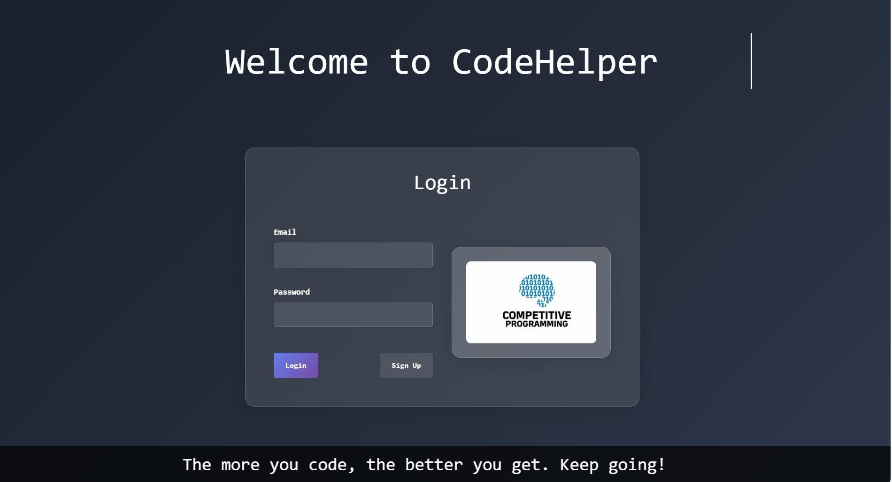
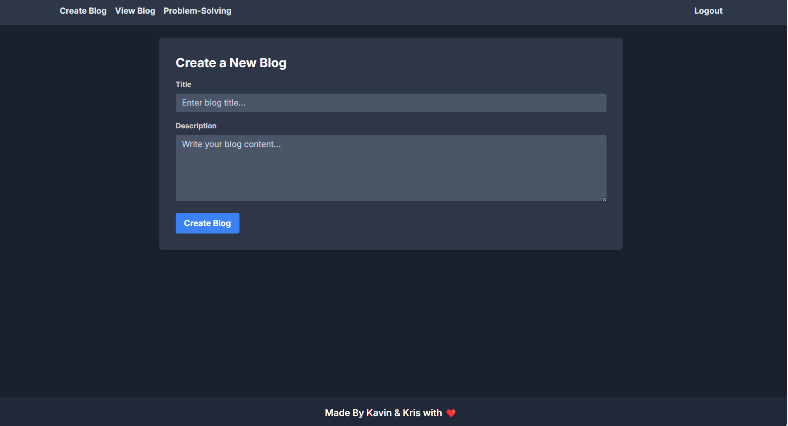
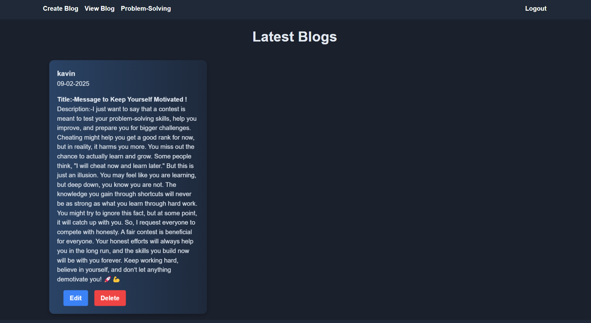
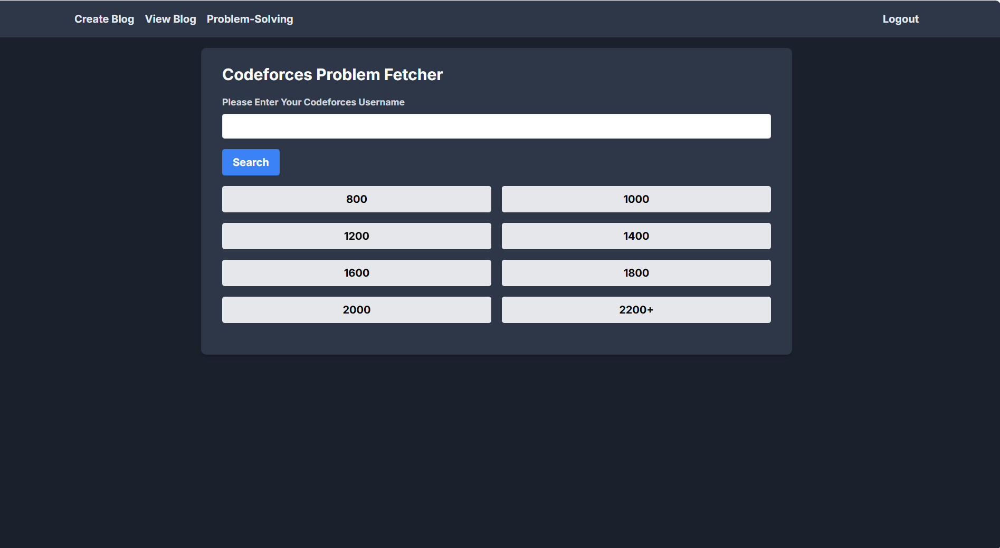

# CodeHelper

CodeHelper is a web application built with the .NET Framework that allows users to manage blogs and get problem recommendations from Codeforces based on their rating. Users can post, view, update their own blogs, and filter unsolved problems by rating range.

## Features

### Blog Management
- **Post a Blog**: Users can create and publish their blogs.
- **View Blogs**: All published blogs are available for viewing.
- **Update Blogs**: Users can edit their own blogs.

### Codeforces Problem Suggestions
- **Personalized Problem Recommendations**: Users can get problem suggestions based on their Codeforces rating (current rating ± 200).
- **Rating Filter**: Users can filter unsolved problems by a specific rating range.
- **Use Codeforces Api** : This allows me to provide problem recommendation as per the user ratings.
- **Direct Problem Redirection**: Clicking on a problem will redirect the user to the Codeforces problem page.

## Installation

1. Clone the repository:
   ```bash
   git clone https://github.com/kavinshahh29/CodeHelper.git
   cd CodeHelper
   ```
2. Open the project in Visual Studio and restore dependencies.
3. Configure the database connection in the configuration file.
4. Run the application.


## Screenshots







## Tech Stack 

- .NET Framework 
- SQL  Server
- Tailwind CSS


## License
This project is licensed under the MIT License.
---

⭐ **Star the repository if you found this useful!**
